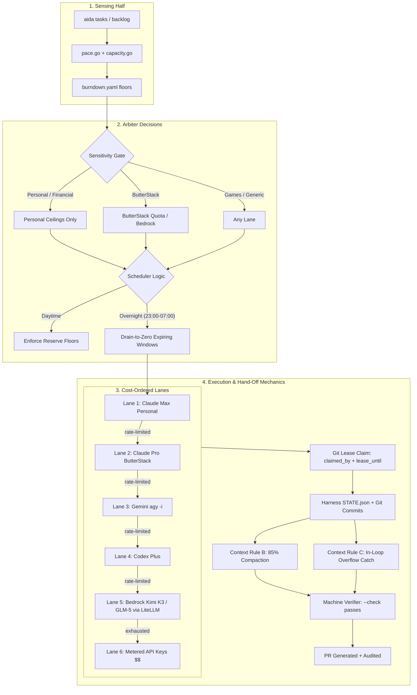
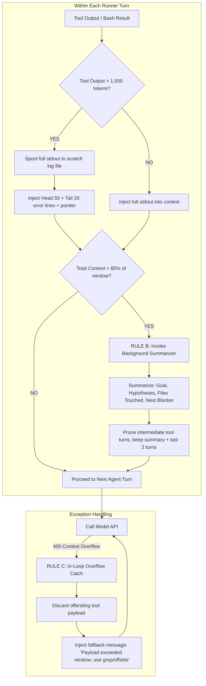

# Architectural Review & Analysis: Aida's Arbiter

> **Context:** Evaluation of Aida's Arbiter design (`docs/arbiter-plan.md`, tasks #481, #497, #498, and PR #172 research) for multi-lane task arbitration, overnight scheduling, hand-offs, and context-management rules (B & C).

---

## 1. Executive Summary & Core Architecture

The **Arbiter** is the "deciding half" of Aida's autonomous system, sitting above the existing "sensing half" (`pace.go`, `burndown.yaml`, `capacity.go`, `aida loop`). Its purpose is to decide **when**, **where**, and **how** to dispatch approved backlog tasks across heterogeneous execution lanes without wasting quota or leaking sensitive context.

---

## 2. The Pros: What is Structurally Right

### 1. Subscription Quota Arbitrage ("Drain-to-Zero")
* **The Problem:** Ryan pays ~$260/month across four subscriptions (Claude Max 20x, ButterStack Pro, ChatGPT Plus, Google AI Pro). Their 5-hour rolling windows and weekly resets expire with substantial unspent capacity.
* **The Solution:** The Arbiter acts as a scavenger: overnight (23:00 to 07:00 ET), daytime personal reserve floors drop to zero for any window resetting before 07:00. This burns "free" subscription capacity on verified backlog tasks before touching a single metered Bedrock or Anthropic API dollar.

### 2. Harness-Controlled State (`STATE.json` Written by Hook, Never by Model)
* **The Problem:** LLMs hallucinate completion, skip verification steps, or emit premature `"DONE"` strings when they encounter tricky tool errors.
* **The Solution:** In Section 6 of your plan, state is written by a `PostToolUse` or `Stop` hook in the harness itself. `Done` is defined strictly by acceptance criteria: **named deliverables exist and the `--check` command passes**. A model cannot "talk" its way out of failing tests.

### 3. Git as the Distributed Lease & Ledger
* **The Problem:** Adding an external message broker (RabbitMQ, SQS, Redis Streams) introduces operational overhead, network dependencies, and another service to babysit on `minty`.
* **The Solution:** Using git commits on the task file (`claimed_by: <lane>@<host>, lease_until: <ts>`) provides atomic leasing via fast-forward pushes, while git history acts as the immutable audit trail. For a 1-to-3 worker fleet, Git is simple, durable, and human-inspectable.

### 4. Hard Data-Class & Sensitivity Gates
* **The Problem:** Model prompts and tool outputs can accidentally leak private credentials or documents into client or public repositories (e.g. the 2026-09-11 incident where a `life-log` file was referenced during a ButterStack run).
* **The Solution:** Hard routing gates: `personal` and `project:finances` tags can only run on personal logins or local hardware. Company work burns the company `hello@` seat or Bedrock credits. Credentials and context planes never cross lanes.

---

## 3. The Cons & Hidden Pitfalls

### Pitfall 1: Mid-Flight Hand-Off Shock (Model Persona Incompatibility)
> [!WARNING]
> **The Risk:** When Lane 1 (Claude Sonnet 5) reports "lane empty" (rate limited), handing the raw multi-turn conversation history to Lane 3 (Gemini 3.8 Flash via `agy`) or Lane 4 (Codex) often degrades reasoning.

* **Why it happens:** Models format tool calls, internal reasoning, and code blocks differently. Gemini or Codex will frequently hallucinate or loop when forced to parse Claude's internal scratchpad format.
* **The Mitigation:** **Hand off only at clean phase boundaries.** Do not pass the raw multi-turn transcript across different model vendors. Instead, let the Arbiter read `STATE.json` + `git log`, synthesize a clean, concise phase brief (*"Phase 1 implemented; Phase 2 tests failing at line 84"*), and launch the new model with a clean context window.

### Pitfall 2: Fragility of Rate-Limit Detection via `Stop` Hooks
> [!CAUTION]
> **The Risk:** In Section 5, the Arbiter relies on a Claude Code `Stop` hook inspecting the last assistant message for a usage-limit refusal.

* **Why it happens:** In headless runs (`claude -p` / `lane4-run.sh`), when Claude Code hits a rate limit, it may exit immediately with exit code 1 or wait on interactive stdin rather than executing a clean `Stop` hook turn.
* **The Mitigation:** Do not rely exclusively on the internal hook. The Arbiter should monitor the runner process from the outside (exit status code, stderr containing `"Usage limit reached"`, or a watchdog timer against active process activity).

### Pitfall 3: Git Lease Contention on Concurrent Ticks
> [!NOTE]
> **The Risk:** Two worker processes (e.g. on `edith` and `minty`) attempting to lease tasks at the same scheduled wake time.

* **Why it happens:** Git push is not an instant lock. If both workers read the queue and attempt to push `status: in-progress`, one push will be rejected as non-fast-forward.
* **The Mitigation:** Enforce a **single Arbiter scheduler** (running as a daemon on `minty` via `aida serve --arbiter`). Other machines and sessions should act as *workers requested by the Arbiter*, rather than independent peer schedulers. Task #498 (read-side fast-forward before pick) is essential.

---

## 4. How Rules B & C Strengthen the Arbiter

Implementing the context-management rules from AWS's recent benchmark disclosures directly fixes the two primary failure modes of autonomous multi-lane agents:

### Rule B: 85% Window Compaction Trigger
* **The Mechanic:** When conversation tokens reach 85% of the model's context capacity, the harness pauses and calls a fast summarizer.
* **The Four Anchors:**
  1. *Primary Objective*
  2. *Hypotheses Tested & Concrete Results*
  3. *Files Modified So Far*
  4. *Immediate Blocker / Next Action*
* **Why it matters for Arbiter hand-offs:** If a task running on Lane 1 must be handed off to Lane 2, a compacted summary creates a clean, tiny context payload (~2k tokens) that any receiving model can parse instantly without cross-vendor prompt shock.

### Rule C: In-Loop Overflow Recovery
* **The Mechanic:** If an agent runs `git diff` or inspects a giant log file that spikes over the hard token ceiling, catch the 400 error *inside the loop*.
* **The Benefit:** Instead of aborting the task, releasing the lease as a failure, and waking Ryan up with an error, the harness drops the giant tool output, replaces it with a warning, and forces the model to refine its query using targeted grep or file slicing.

---

## 5. Architectural Recommendations

1. **Promote Bedrock Kimi K3 / GLM-5 into Lane 5 (Retire the EC2 Qwen Plan):**
   * *Original Plan:* Lane 5 was an on-demand `g6.xlarge` EC2 GPU instance (~$1.86/hr) running Qwen.
   * *Updated Reality:* With **Kimi K3 (67.5% DeepSWE)** and **GLM-5 (69.0% DeepSWE)** now live and verified on your ButterStack Bedrock account through LiteLLM on `minty`, you can make Lane 5 **Bedrock Kimi K3**. You get superior SWE performance, zero hourly idle GPU cost, zero AMI bootstrapping, and native token billing against your AWS credits.
2. **Single-Scheduler Invariant:**
   * Designate `minty` as the sole Arbiter daemon (`aida serve --arbiter`). All other machines (`edith`, `beast`) should request work or act as workers, preventing git lease split-brain.
3. **Phase-Boundary Handoffs:**
   * Never hand off raw conversation histories across different model vendors. Hand off structured `STATE.json` and git commit diffs.
4. **Bake Rules B & C into `lane4-run.sh` & `aida loop`:**
   * Implement tool truncation at ~1,500 tokens and summarization at 85% capacity directly in the runner script to protect your subscription quota from exponential turn-by-turn bloat.
