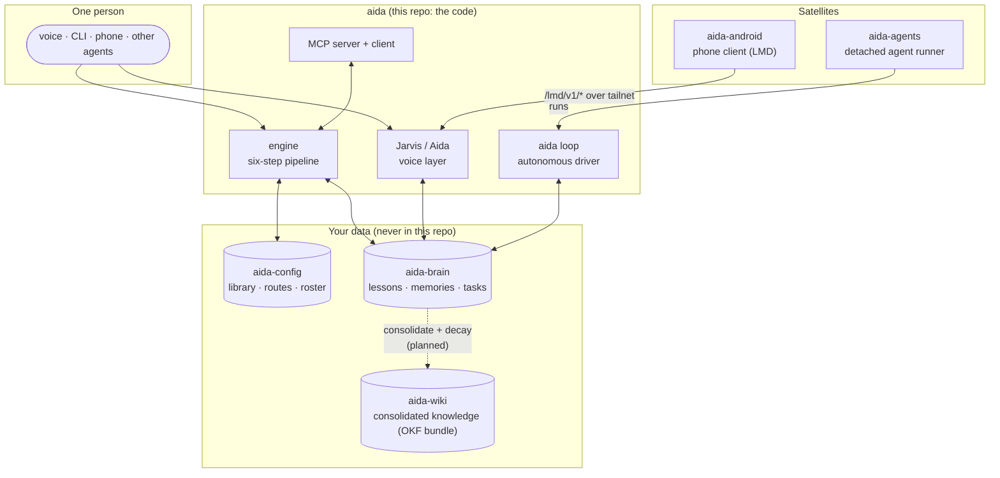

# Ecosystem map

What actually got built: one binary at the center, with config, memory, and
satellite projects as separate repos. Solid arrows are runtime reads/writes;
dashed arrows are planned or indirect. Public/private disposition per repo is
in `docs/diagrams/three-repo-cut.md`.

Reading the picture:

- **Code, config, and memory are three git repos.** The code is public; the
  config repo encodes *whose* life this is (sources, routes, call-signs) and
  the brain repo holds everything ever said to it. Both stay private, and
  `aida init` bootstraps empty stand-ins for a new user.
- **Every surface converges on one brain.** Typed queries, voice turns, the
  phone, the loop, and other agents (via MCP) read and write the same lessons,
  memories, and tasks: that is what makes memory compound instead of
  fragmenting per tool.
- **The satellites are consumers of the contracts,** not forks: the Android
  client speaks the LMD wire protocol, and the agent runner drives the same
  task queue the loop drains.
