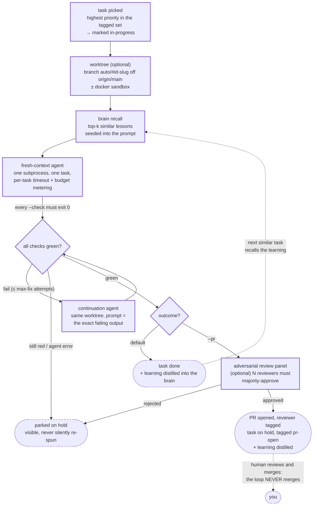

# Loop lifecycle: task → agent → gate → PR (never merge)

One task's path through `aida loop`. Full internals in
`docs/notes/loop-internals.md`.

Three properties the shape encodes:

- **The gate is a loop, not a verdict.** A red check re-spawns a continuation
  agent with the failure text as its prompt, up to `--max-fix-iterations`
  times: iterate-until-green in the same worktree, then park on `hold` if it
  never greens. Failure is a visible state, not a retry storm.
- **The human sits at exactly two points**: reviewing the PR and merging it.
  Everything before that is autonomous but bounded (budget cap, consecutive-
  failure circuit breaker, per-task timeout, round cap).
- **The dashed return edge is the compounding loop**: each passing task's
  `## Learnings` section becomes an embedded brain lesson that the recall step
  feeds to the next similar task's fresh agent.
