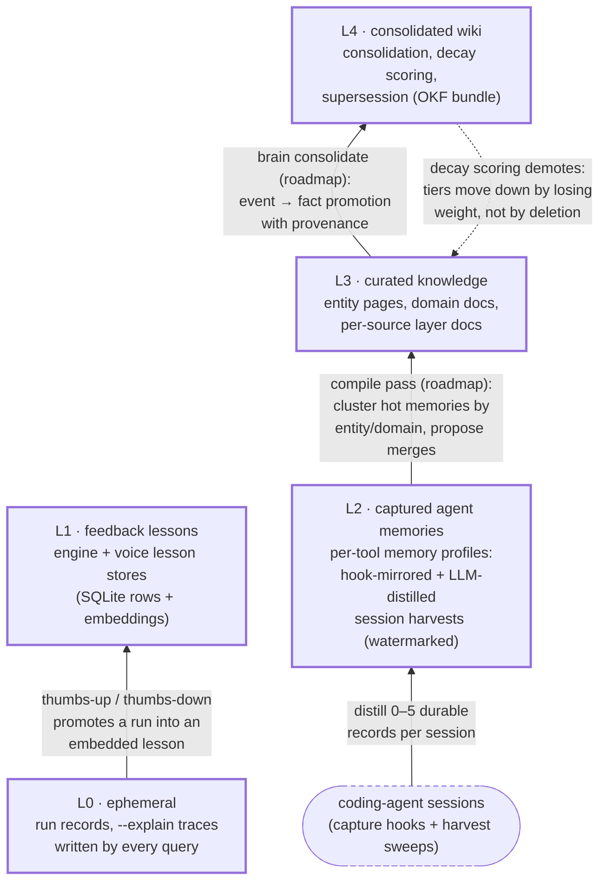

# Memory levels L0–L4

Aida's memory is a tiered stack. Records move **up** through automated hooks
(solid arrows) and are designed to move **down** by losing weight through
decay scoring, never by deletion (dashed arrow). Files are the source of
truth at every level; `brain.db` is a derived index that rebuilds itself,
detached, when stale.

| Level | Store | Written by | Recalled by |
|---|---|---|---|
| L0 ephemeral | run records, `--explain` traces | every query | `aida runs`, debugging |
| L1 feedback lessons | engine + voice lesson tables (SQLite + embeddings) | thumbs up/down, notes | router boosts, voice-turn prompt injection |
| L2 captured agent memories | per-tool brain memory profiles (hook-mirrored, or LLM-distilled from session transcripts, watermarked and incremental) | coding-agent sessions | `brain_recall` (MCP), `aida brain recall`, voice recall tool |
| L3 curated knowledge | entity pages, domain docs, per-source layer docs | human + LLM compile passes | `brain_search`, source context injection |
| L4 consolidated wiki | the wiki bundle (OKF) | `aida brain consolidate` (planned) | wiki commands, brain |

The through-line: **feedback and hooks promote; decay demotes; humans curate
exceptions, not the pipeline.** The tiers only earn their keep because records
move between them without a human shepherding each one: session→L2 and
L0→L1 movement is fully automated today; the L2→L3 compile pass and L3→L4
consolidation are the roadmap's promotion hooks. Prior art credited in
`docs/notes/inspiration.md` (Elastic's Atlas for promotion/decay, OpenViking
as convergent evolution).
