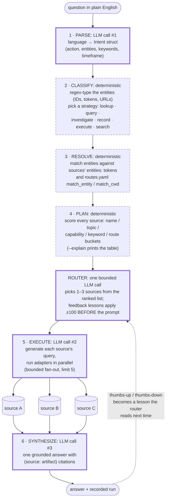

# The six-step pipeline

The signature picture: **LLM at the edges, deterministic middle**. Exactly
three core LLM calls per query: parse, execute, synthesize, plus one bounded
router call. Everything between them is config-driven, testable, and
reproducible: the model never freely decides where to look.

Thick-bordered nodes spend LLM tokens; dashed nodes are pure deterministic
code. (Shapes carry the distinction so the diagram survives light and dark
themes.)

Why this shape:

- **The LLM parses language in and prose out; the middle is a rulebook you can
  read.** Routing is data (source YAML capabilities, `entities:` topic tokens,
  `routes.yaml`), so adding a knowledge source is writing a config file, and a
  routing bug is reproducible instead of a vibe.
- **The router is bounded, not sovereign.** It chooses among candidates the
  deterministic planner already ranked, and user corrections adjust those
  ranks as arithmetic before the model sees the prompt
  (`docs/notes/feedback-mechanics.md`).
- **The feedback edge is the compounding loop**: every rated run makes the
  next similar question route better, mechanically.
