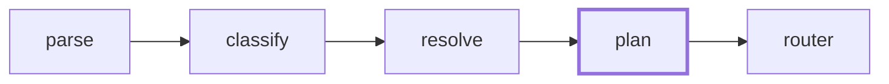

# Routing walkthrough: one query, annotated

What `--explain` shows for one (fictional) query, and how to read it. The
scoring buckets and table shape come from the real planner
(`internal/engine/planner.go`, `FormatExplain`); the sources and numbers below
are a worked example on a made-up home library.

Where this trace sits in the six-step pipeline: the annotated table below is
the `plan` step's own scoring work laid bare.



The library has six sources; the two that matter:

```yaml
# ~/.aida/library/sources/wakanda-api.yaml
type: codebase
entities: [wakanda, vibranium-checkout]

# ~/.aida/library/sources/ops-logs.yaml
type: tool
description: query the error/latency logs for the home services
capabilities: [log-query, error-investigation, api-monitoring]
```

and `~/.aida/library/routes.yaml` has a `match_entity: wakanda` route that
activates both.

## The query

```
$ aida "any 500 errors in wakanda-api last night?" --explain
```

Parse (LLM call #1) extracts `action: investigate`, keywords
`[500, errors, last night]`, raw entity `wakanda-api`. Classify picks the
`investigate` strategy deterministically. Resolve matches `wakanda` against
the sources' `entities:` tokens, which trips the `match_entity` route. Then
the planner prints its work:

```
Planner scoring (6 candidates, 2 picked)
  score  source           name  topic  cap   kw  type  route  picked
  -----  ---------------  ----  -----  ---  ---  ----  -----  --------
  130    wakanda-api        30      0    0    0     0    100  → diagnose
  120    ops-logs            0      0   15    2     3    100  → diagnose
  ---  zero-score (considered, cut)  ---
  0      web-search          0      0    0    0     0      0
  0      recipe-box          0      0    0    0     0      0
  0      family-calendar     0      0    0    0     0      0
  0      workshop-notes      0      0    0    0     0      0

Notes for picked sources:
  wakanda-api (score=130):
    name-match  +30  raw entity 'wakanda-api' == source name
    route-boost +100 cwd/entity route matched
  ops-logs (score=120):
    capability  +5   source has 'log-query'
    capability  +5   source has 'error-investigation'
    capability  +5   source has 'api-monitoring'
    keyword-desc +2  description contains 'error'
    type-bonus  +3   tool + investigate strategy
    route-boost +100 cwd/entity route matched
```

## How to read each number

- **`name` +30, and it's terminal.** The question literally named
  `wakanda-api`, the strongest possible signal. A name match deliberately
  *skips* the other buckets for that source, so a source can't double-count by
  also listing its own name in its `entities:`.
- **`cap` +5 each.** The `investigate` strategy plus the keyword `500` demand
  `log-query` / `error-investigation` / `api-monitoring`; `ops-logs`
  advertises all three. Capability points are small on purpose: they express
  "could plausibly answer", not "is the answer".
- **`kw` +2, `type` +3.** Description and source-type nudges. Single digits,
  tie-breakers only.
- **`route` +100.** The `match_entity: wakanda` route restricts the candidate
  set to its sources and boosts them; everything outside the route lands in
  the "considered, cut" tail (visible, so a missing source is a config
  diagnosis, not a mystery).
- **The magnitudes are the message.** Route membership (100) dominates name
  (30), which dominates topic (8) and capability (5), which dominate keyword
  noise (2–3). Corrections outrank all of it: a past thumbs-down lesson on a
  similar question applies **±100** per intended/excluded source before the
  router prompt is built, and the router's own pick then adds +1000 to the
  final selection: an LLM choice layered *on top of* deterministic order,
  never instead of it.

## Then the bounded LLM call

The router (the one bounded LLM call between plan and execute) sees the ranked
list (names, descriptions, topics, `prior_score`) plus any similar past
lessons as prose, and picks 1–3 sources. Here it confirms both candidates;
execute fans out to them in parallel, and synthesize cites what came back:

```
Answer: 3 requests 500'd in wakanda-api between 11pm and midnight, all in
the vibranium-checkout handler … (ops-logs: last-night error query;
wakanda-api: handler source)
```

If that had routed wrong, `aida thumbs-down --because "no need for
web-search, should have used ops-logs"` turns into arithmetic on this exact
table next time: see `docs/notes/feedback-mechanics.md`.
