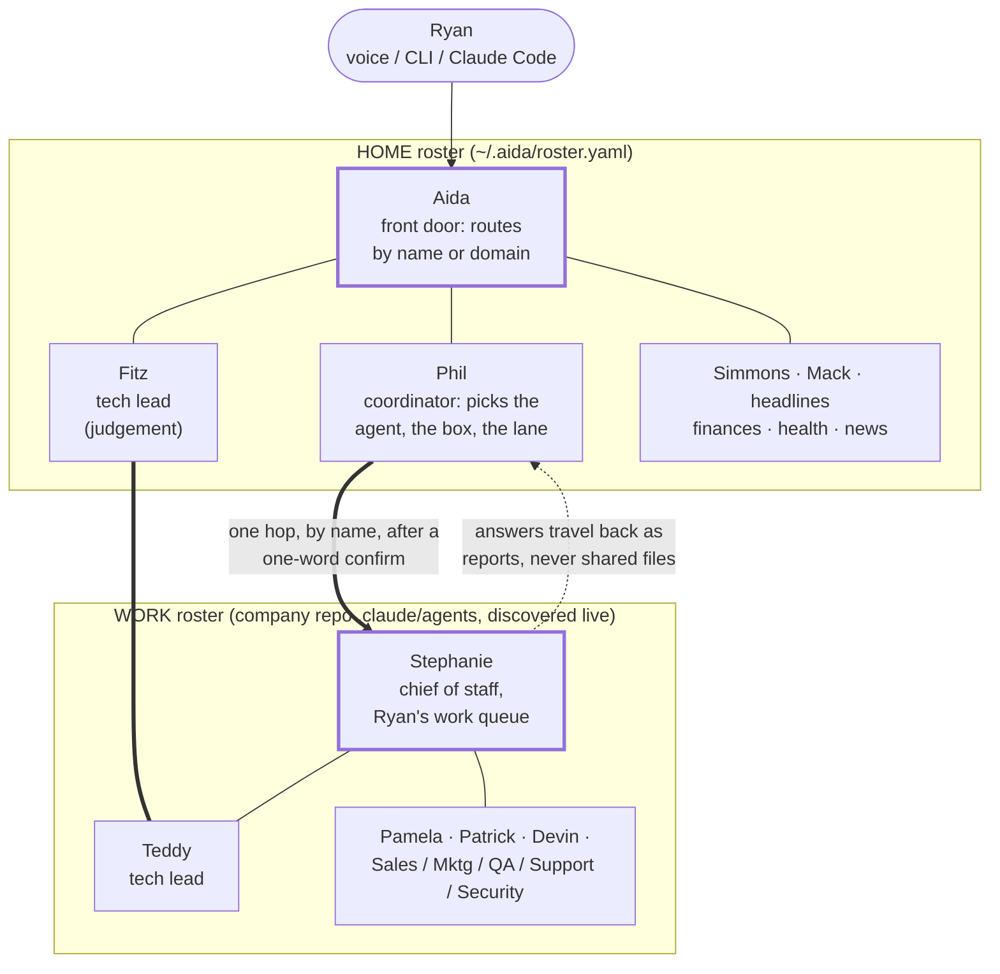

# Two teams, one seam: how Aida's home roster talks to the ButterStack roster

For blog part 4 ("What it spawned"), the ButterStack section. First cut 2026-09-07 from a live session as ASCII; mermaid diagram reworked 2026-09-13 following a design critique. The ASCII below is kept for reference.



The original ASCII first cut, kept as the reference for the redesign:

```
                         Ryan (voice / CLI / Claude Code)
                                   |
                                   v
 HOME profile  (~/.aida)     +-----------+
                             |   Aida    |  front door, routes by name or domain
                             +-----------+
            ______________________|_______________________
           |          |           |          |            |
        Simmons     Mack        Phil       Fitz       headlines
        finances    health   chief of    tech lead     NYT
                             staff       (judgement)
                                 |          |
        ---- one hop, by name, one-word confirm, report back ----
        aida ask <call-sign>  ->  claude --print --agent <persona>
        cwd = the company repo   (AIDA_DISPATCH_DEPTH+1: no re-entry)
                                 |          |
                                 v          v
 WORK profile  (<company repo>/.claude/agents, discovered live)
                             +-----------+
                             | Stephanie |  chief of staff, Ryan's work queue
                             +-----------+
            ______________________|_______________________
           |          |           |          |            |
        Teddy       Pamela     Patrick     Devin      Sales/Mktg/
        tech lead   product    project     devops     QA/Support/
                    mgr (tix)  mgr (co-    (SRE)      Security...
                               founder +
                               BizOps)
```

## What the picture has to say

- **Two rosters, one binary, one person.** The home roster lives in `~/.aida/roster.yaml`. The work roster is not copied anywhere: a single `discover:` entry expands live into one virtual call-sign per persona file in the company repo's `.claude/agents/`, so a growing team never goes stale. Same `aida` binary, profile decides which roster is in front of you.
- **Counterparts, not a hierarchy.** Phil pairs with Stephanie (Phil coordinates the home roster, deciding which agent runs where and how; Stephanie owns Ryan's queue on the company side). Fitz pairs with Teddy (engineering judgement, never code). Nobody on either side edits the other side's repo.
- **One hop, by name, then home.** A home agent may call a work agent once (`aida ask pamela "..."`), after a one-word confirm from Ryan when the call crosses the line. The transport is a plain `claude --print --agent <persona>` subprocess in the company repo. Every spawned process carries `AIDA_DISPATCH_DEPTH` one higher than it inherited, and `aida ask` refuses to run at depth 2, so the callee cannot call back and the graph cannot recurse.
- **Answers travel as reports, never as shared files.** The asking agent files what came back under its own `handoffs/` folder. The company's documents never mention Aida; the personal side never writes into the company's boards or workspaces.
- **Writes stay in lane on both sides.** Pamela files the company's tickets (on Ryan's verbatim "file it"). Stephanie reads everything and writes only her own workspace. Patrick mirrors the co-founder's process. The seam is a protocol, not a shared drive.

## Worked example (2026-09-07)

Ryan closed a stale personal task ("update the website with real screenshots", open since April) by handing it across the seam: Aida asked Pamela to write it up, Pamela searched for duplicates, filed the issue with labels and board placement, and replied with the issue number. Aida closed the personal task with that number in its body. Total: one hop out, one report back, two systems consistent, zero shared files.

## Blog rules that apply

Company references stay at the architecture-pattern level (call-signs and roles are fine, ticket contents are not). Employer references stay generic. No em dashes.
