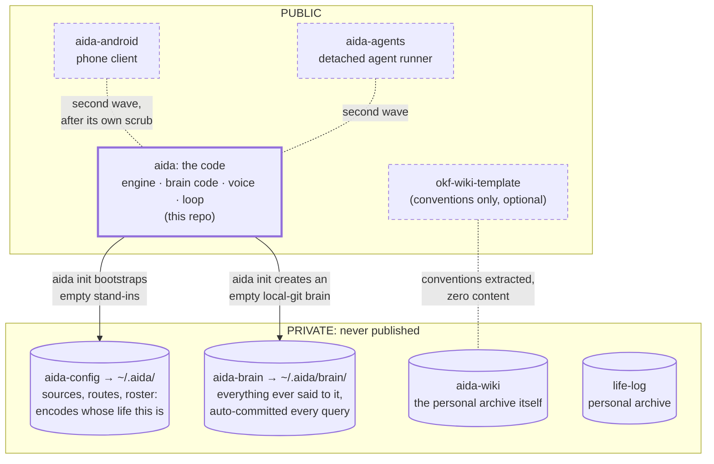
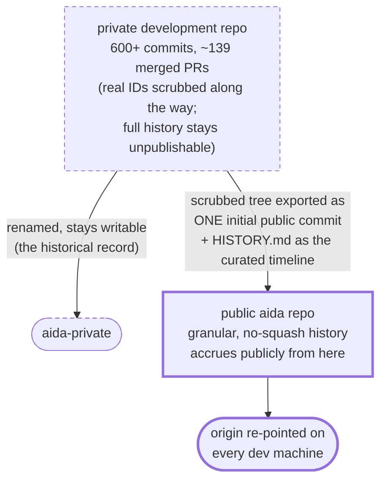

# Three repos, one fresh cut

What is public, what stays private, and how the public repo was born. This
doubles as the transparency statement: the code ships; the person stays home.

## Public vs private

The split is what makes open-sourcing tractable at all: **code, config, and
memory are three git repos.** The public repo is the code; the private repos
are the person. A new machine is two private clones and an env file; a new
*user* is `aida init`, which bootstraps an empty `~/.aida/` and an empty,
locally-git-initialized brain: point them at your own **private** remotes to
get the same backup story.

## The fresh cut

Why a fresh start instead of publishing the rewritten history: on GitHub,
force-pushed-away commits remain reachable by SHA, in cached views, and
through `refs/pull/*`. With ~139 merged PRs, essentially every original
commit would survive even a perfect `git filter-repo` pass. Flipping the
original repo public can never be made safe, so it never happens. The public
repo starts from one clean commit; `HISTORY.md` ships as the curated,
sanitized record of what was built and when, and old PR numbers in docs point
at the renamed private repo instead.
