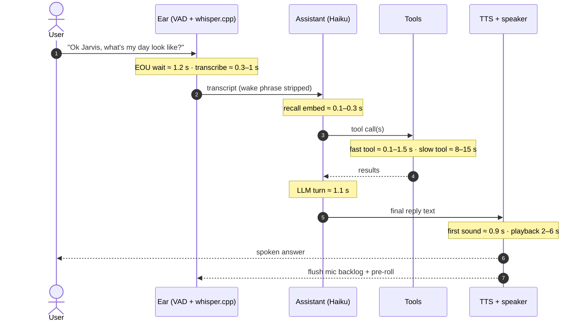

# A voice turn, with the latency budget

One wake-triggered turn through the always-on listener, timed from the
per-stage fields the audit log records on every real turn. Full mechanics in
`docs/notes/voice-pipeline.md`.

**End to end: 2–4 s** for a fast-tool turn, **8–15 s** when the engine is
involved. Two budget lessons the numbers teach:

- **The fixed costs bracket the turn.** ~1.2 s of VAD silence-wait going in
  and 2–6 s of playback coming out are paid regardless of how smart the middle
  is: playback wall-clock usually exceeds all compute combined.
- **Perceived latency is governed by acknowledgment, not speed.** The canned
  ack before slow tools and a progress phrase at the 90 s mark of a long
  subprocess bought more perceived responsiveness than any pipeline
  optimization did.

The last arrow is a real step, not decoration: the turn ends by flushing the
assistant's own audio out of the mic pipeline: the fix for the day it
answered itself (`docs/notes/failure-stories.md`, story 1).
